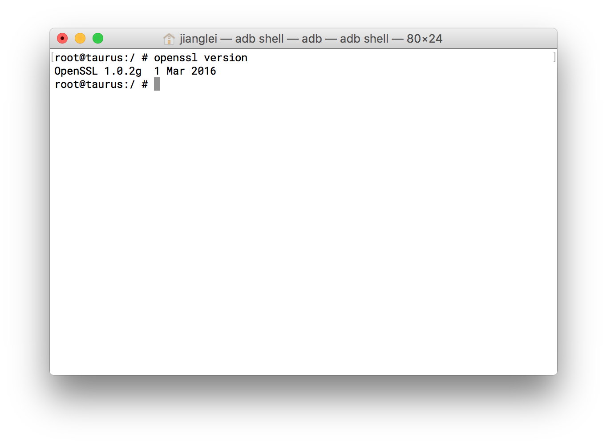

#openssl

OpenSSL 是一个强大的安全套接字层密码库，囊括主要的密码算法、常用的密钥和证书封装管理功能及SSL协议，并提供丰富的应用程序供测试或其它目的使用。[主页](http://www.openssl.org)

本项目基于目前最新的openssl版本`1.1.0` 。直接可以使用ndk-build编译。编译完成后需要把/etc/目录下的配置文件push到安卓系统的/system/lib/ssl文件夹下。

####注意：

openssl不能用于android M，否则会导致无法开机。这是由于Google采用了其boringssl代替了openssl。